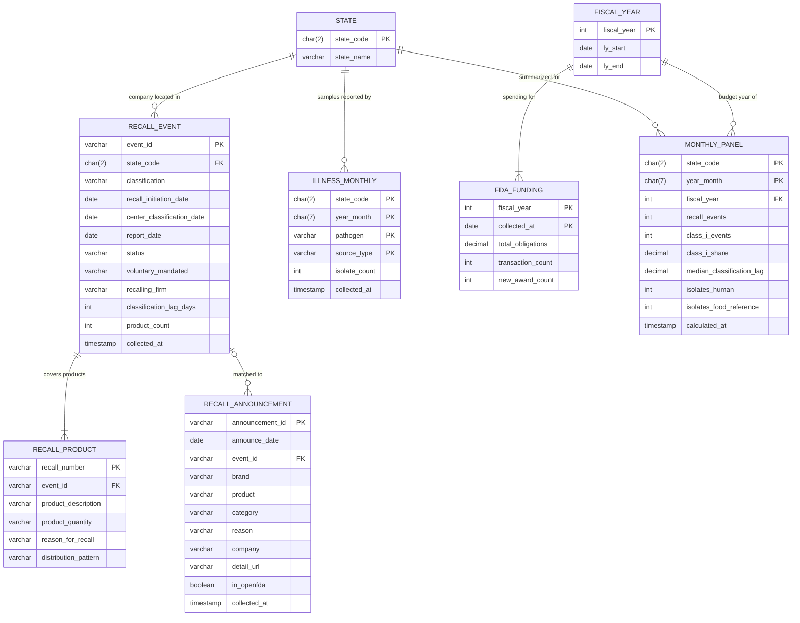

```mermaid
erDiagram
    STATE {
        char(2) state_code PK
        varchar state_name
    }

    FISCAL_YEAR {
        int fiscal_year PK
        date fy_start
        date fy_end
    }

    RECALL_EVENT {
        varchar event_id PK
        char(2) state_code FK
        varchar classification
        date recall_initiation_date
        date center_classification_date
        date report_date
        varchar status
        varchar voluntary_mandated
        varchar recalling_firm
        int classification_lag_days
        int product_count
        timestamp collected_at
    }

    RECALL_PRODUCT {
        varchar recall_number PK
        varchar event_id FK
        varchar product_description
        varchar product_quantity
        varchar reason_for_recall
        varchar distribution_pattern
    }

    RECALL_ANNOUNCEMENT {
        varchar announcement_id PK
        date announce_date
        varchar event_id FK
        varchar brand
        varchar product
        varchar category
        varchar reason
        varchar company
        varchar detail_url
        boolean in_openfda
        timestamp collected_at
    }

    ILLNESS_MONTHLY {
        char(2) state_code PK
        char(7) year_month PK
        varchar pathogen PK
        varchar source_type PK
        int isolate_count
        timestamp collected_at
    }

    FDA_FUNDING {
        int fiscal_year PK
        date collected_at PK
        decimal total_obligations
        int transaction_count
        int new_award_count
    }

    MONTHLY_PANEL {
        char(2) state_code PK
        char(7) year_month PK
        int fiscal_year FK
        int recall_events
        int class_i_events
        decimal class_i_share
        decimal median_classification_lag
        int isolates_human
        int isolates_food_reference
        timestamp calculated_at
    }

    STATE        ||--o{ RECALL_EVENT        : "company located in"
    STATE        ||--o{ ILLNESS_MONTHLY     : "samples reported by"
    STATE        ||--o{ MONTHLY_PANEL       : "summarized for"
    RECALL_EVENT ||--|{ RECALL_PRODUCT      : "covers products"
    RECALL_EVENT |o--o{ RECALL_ANNOUNCEMENT : "matched to"
    FISCAL_YEAR  ||--|{ FDA_FUNDING         : "spending for"
    FISCAL_YEAR  ||--o{ MONTHLY_PANEL       : "budget year of"
```